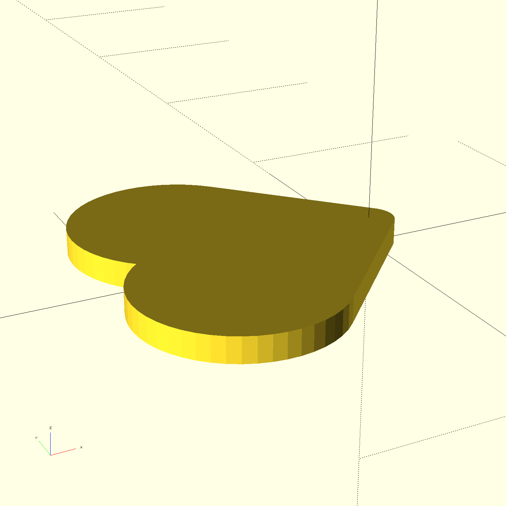

# Design Time - Transforming Shapes

## [Heart.scad](Heart.scad)

## [OpenSCAD-Logo.scad](OpenSCAD-Logo.scad)

## [Guitar-Pick.scad](Guitar-Pick.scad)

## [Snowman.scad](Snowman.scad)

## [Modern-Table.scad](Modern-Table.scad)

## [Top-Hat.scad](Top-Hat.scad)

